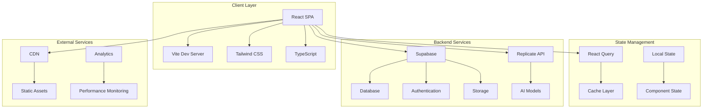
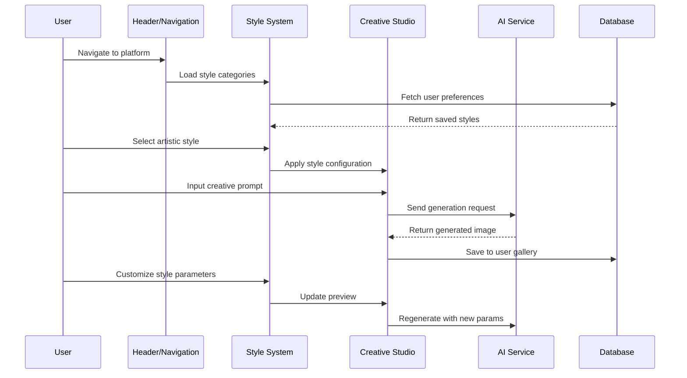
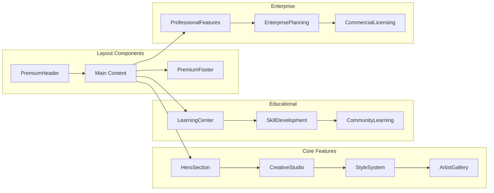
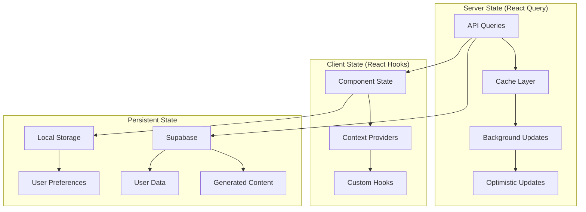
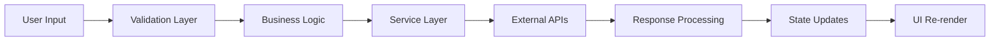
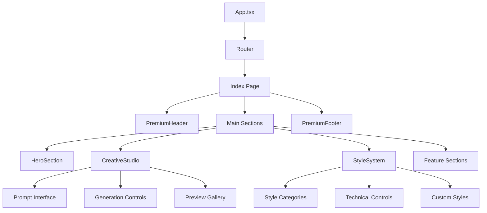
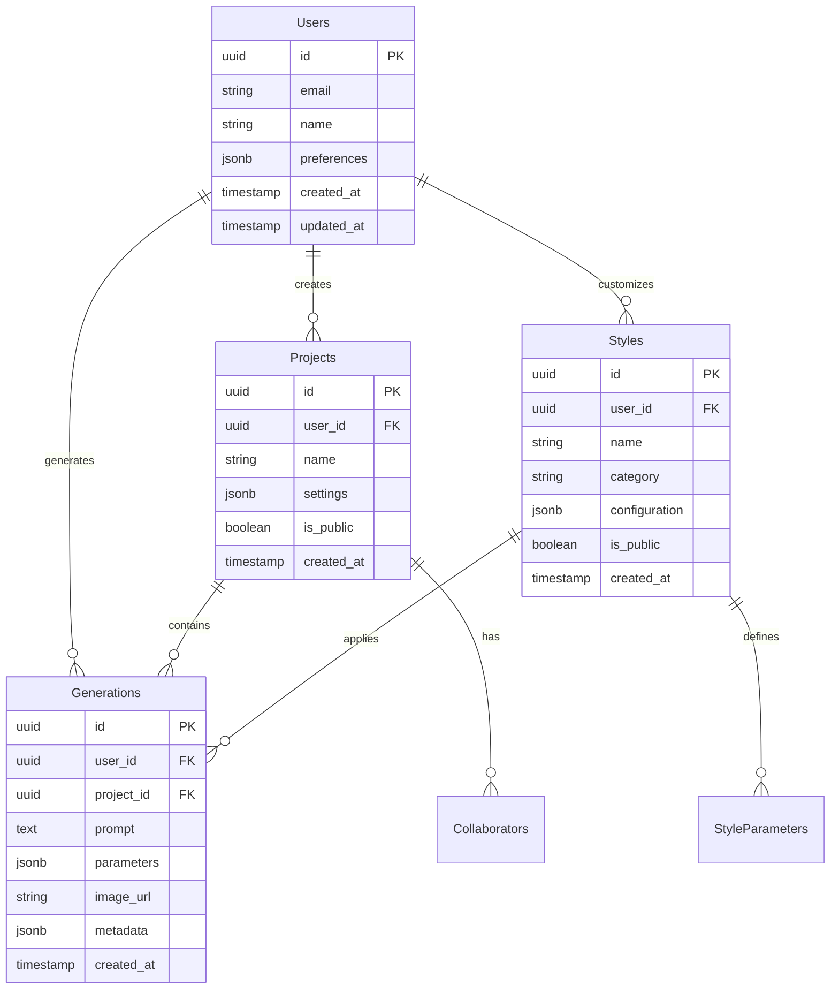
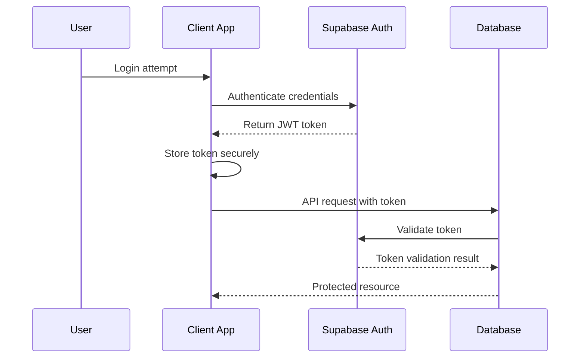
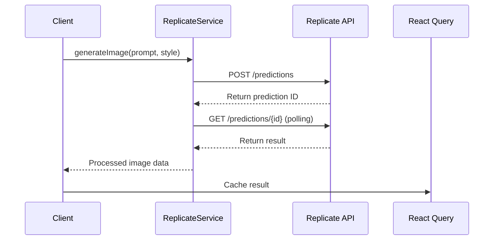
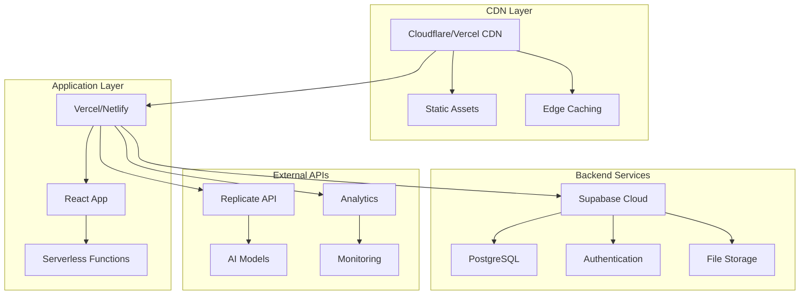

# System Architecture Documentation

## Overview
This document provides comprehensive architectural documentation for the Lovable AI Creative Platform, including system design, data flows, and integration patterns.

**Last Updated:** 2025-06-07  
**Version:** 1.0.0  
**Architecture Type:** Single Page Application (SPA) with Backend-as-a-Service

---

## Table of Contents
1. [System Overview](#system-overview)
2. [User Interaction Flow](#user-interaction-flow)
3. [Data Flow Architecture](#data-flow-architecture)
4. [Component Architecture](#component-architecture)
5. [Database Design](#database-design)
6. [Authentication & Security](#authentication--security)
7. [API Integration](#api-integration)
8. [Deployment Architecture](#deployment-architecture)

---

## System Overview

### High-Level Architecture

### Technology Stack
| Layer | Technology | Purpose |
|-------|------------|---------|
| **Frontend** | React 18 + TypeScript | UI framework with type safety |
| **Build Tool** | Vite | Fast development and production builds |
| **Styling** | Tailwind CSS + CSS Variables | Utility-first styling with design system |
| **UI Components** | Radix UI + shadcn/ui | Accessible, composable components |
| **State Management** | React Query + React Hooks | Server state + client state |
| **Backend** | Supabase | Database, auth, storage BaaS |
| **AI Integration** | Replicate API | AI model inference |
| **Routing** | React Router v6 | Client-side navigation |

---

## User Interaction Flow

### Primary User Journey

### Component Interaction Flow

---

## Data Flow Architecture

### State Management Pattern

### Data Processing Pipeline

---

## Component Architecture

### Core Component Hierarchy

### Component Responsibilities

#### **PremiumHeader Component**
- **Purpose**: Primary navigation and branding
- **Features**: Responsive menu, user authentication status, premium branding
- **Dependencies**: UI components (Button, Sheet), Lucide icons
- **State**: Navigation state, mobile menu toggle

#### **CreativeStudio Component**
- **Purpose**: AI image generation interface
- **Features**: Prompt input, style selection, parameter controls, result gallery
- **Dependencies**: ReplicateService, UI components, image optimization
- **State**: Generation parameters, loading states, results cache

#### **StyleSystem Component**
- **Purpose**: Advanced artistic style management
- **Features**: Style categories, technical controls, custom presets, mixing
- **Dependencies**: Complex UI components (Tabs, Sliders, Selects)
- **State**: Active styles, custom configurations, saved presets
- **Note**: 471 lines - requires refactoring into smaller components

#### **ArtistGallery Component**
- **Purpose**: Showcase generated artwork and artist portfolios
- **Features**: Masonry layout, filtering, modal views, professional presentation
- **Dependencies**: Image optimization, modal components, filtering logic
- **State**: Gallery items, filter settings, modal state

---

## Database Design

### Supabase Schema

### Data Access Patterns
- **Read Heavy**: Gallery browsing, style exploration
- **Write Patterns**: Image generation, style customization
- **Caching Strategy**: React Query for API responses, browser cache for images
- **Real-time Updates**: Supabase subscriptions for collaborative features

---

## Authentication & Security

### Authentication Flow

### Security Measures
- **Authentication**: Supabase Auth with JWT tokens
- **Authorization**: Row Level Security (RLS) policies
- **Data Validation**: Client-side + server-side validation
- **Content Safety**: ComplianceMonitor service for generated content
- **API Security**: Rate limiting, CORS configuration
- **Privacy**: GDPR compliance, data anonymization options

---

## API Integration

### Replicate API Integration

### API Lifecycle Management
1. **Request Formation**: Parameter validation and formatting
2. **Error Handling**: Retry logic, fallback strategies
3. **Response Processing**: Image optimization, metadata extraction
4. **Caching**: Intelligent caching with React Query
5. **Rate Limiting**: Respect API limits, queue management

---

## Deployment Architecture

### Production Environment

### Deployment Pipeline
1. **Development**: Local Vite dev server
2. **Staging**: Preview deployments on feature branches
3. **Production**: Automated deployment on main branch
4. **Monitoring**: Performance metrics, error tracking
5. **Rollback**: Instant rollback capabilities

### Performance Optimization
- **Bundle Splitting**: Code splitting by route and feature
- **Image Optimization**: WebP conversion, lazy loading
- **Caching Strategy**: Aggressive caching with cache invalidation
- **CDN Usage**: Global content delivery
- **Preloading**: Critical resource preloading

---

## System Boundaries & Interfaces

### External System Integrations
| System | Interface Type | Purpose | Data Flow |
|--------|----------------|---------|-----------|
| Replicate API | REST API | AI image generation | Bidirectional |
| Supabase | REST + Realtime | Database, auth, storage | Bidirectional |
| CDN | HTTP | Static asset delivery | Outbound |
| Analytics | JavaScript SDK | Usage tracking | Outbound |

### Security Checkpoints
- **Input Validation**: All user inputs sanitized
- **Authentication Gates**: Protected routes and API calls
- **Content Filtering**: AI-generated content screening
- **Rate Limiting**: API usage protection
- **Data Encryption**: In-transit and at-rest encryption

---

**Document Version:** 1.0.0  
**Last Updated:** 2025-06-07  
**Next Review:** 2025-07-07  
**Architecture Review Cycle:** Quarterly
