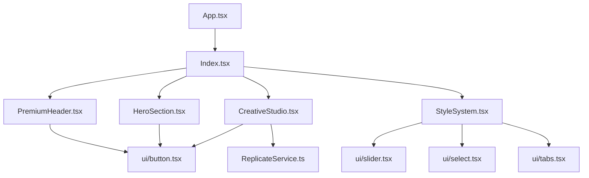

# Project Structure Analysis

## Overview
This document provides a comprehensive analysis of the Lovable AI Creative Platform codebase, including file purposes, dependencies, and usage patterns.

**Last Updated:** 2025-06-07  
**Version:** 1.0.0  
**Total Files:** ~100+  
**Primary Language:** TypeScript/React

---

## Project File Tree

```
📁 lovable-ai-creative-platform/
├── 📄 README.md                           🟢 Project documentation and setup guide
├── 📄 package.json                        🟢 Dependencies and scripts configuration
├── 📄 package-lock.json                   🟢 Dependency version lock file
├── 📄 vite.config.ts                      🟢 Vite build configuration
├── 📄 tailwind.config.ts                  🟢 Tailwind CSS configuration with design system
├── 📄 tsconfig.json                       🟢 TypeScript configuration
├── 📄 tsconfig.app.json                   🟡 App-specific TypeScript config
├── 📄 tsconfig.node.json                  🟡 Node.js TypeScript config
├── 📄 postcss.config.js                   🟡 PostCSS configuration for Tailwind
├── 📄 eslint.config.js                    🟡 ESLint configuration
├── 📄 components.json                     🟡 shadcn/ui components configuration
├── 📄 bun.lockb                          🔴 Bun package manager lock file
├── 📄 .gitignore                         🔴 Git ignore patterns
│
├── 📁 public/                             Public assets directory
│   ├── 📄 favicon.ico                     🔴 Website favicon
│   ├── 📄 placeholder.svg                 🔴 Placeholder image for development
│   └── 📄 robots.txt                      🔴 Search engine crawling rules
│
├── 📁 src/                               Main source code directory
│   ├── 📄 main.tsx                       🟢 Application entry point (React DOM render)
│   ├── 📄 App.tsx                        🟢 Root application component with routing
│   ├── 📄 App.css                        🔴 Legacy CSS file (unused)
│   ├── 📄 index.css                      🟢 Global CSS with design system variables
│   ├── 📄 vite-env.d.ts                  🔴 Vite environment type definitions
│   │
│   ├── 📁 pages/                         Application pages
│   │   ├── 📄 Index.tsx                  🟢 Main landing page with all sections
│   │   └── 📄 NotFound.tsx               🟡 404 error page component
│   │
│   ├── 📁 components/                    React components directory
│   │   ├── 📄 PremiumHeader.tsx          🟢 Main navigation header component
│   │   ├── 📄 HeroSection.tsx            🟢 Landing page hero section
│   │   ├── 📄 CreativeStudio.tsx         🟢 AI image generation interface
│   │   ├── 📄 StyleShowcase.tsx          🟢 Style gallery and showcase
│   │   ├── 📄 StyleSystem.tsx            🟢 Advanced style management system [471 lines - needs refactoring]
│   │   ├── 📄 ArtistGallery.tsx          🟢 Artist portfolio and gallery
│   │   ├── 📄 LearningCenter.tsx         🟢 Educational content hub
│   │   ├── 📄 SkillDevelopment.tsx       🟡 Skill building features
│   │   ├── 📄 CommunityLearning.tsx      🟡 Community learning platform
│   │   ├── 📄 CommercialLicensing.tsx    🟡 Commercial usage and licensing
│   │   ├── 📄 ProfessionalFeatures.tsx   🟡 Professional workflow tools
│   │   ├── 📄 QualityEthics.tsx          🟡 Quality assurance and ethics
│   │   ├── 📄 MarketingSection.tsx       🟡 Platform marketing and positioning
│   │   ├── 📄 EnterprisePlanning.tsx     🟡 Enterprise features and solutions
│   │   ├── 📄 PremiumFooter.tsx          🟡 Site footer with links
│   │   ├── 📄 WorkspaceManager.tsx       🟡 Project workspace management
│   │   ├── 📄 PerformanceMonitor.tsx     🟡 System performance monitoring
│   │   ├── 📄 APIIntegration.tsx         🔴 API integration components
│   │   ├── 📄 ArtworkModal.tsx           🔴 Artwork detail modal
│   │   ├── 📄 GalleryFilters.tsx         🔴 Gallery filtering interface
│   │   └── 📄 EnterpriseWorkspace.tsx    🔴 Enterprise workspace features
│   │   │
│   │   └── 📁 ui/                        shadcn/ui component library
│   │       ├── 📄 accordion.tsx          🟢 Collapsible content component
│   │       ├── 📄 alert-dialog.tsx       🟡 Modal alert dialog
│   │       ├── 📄 alert.tsx              🟡 Alert notification component
│   │       ├── 📄 aspect-ratio.tsx       🟡 Responsive aspect ratio container
│   │       ├── 📄 avatar.tsx             🟡 User avatar component
│   │       ├── 📄 badge.tsx              🟢 Status and category badges
│   │       ├── 📄 breadcrumb.tsx         🔴 Navigation breadcrumb
│   │       ├── 📄 button.tsx             🟢 Primary button component
│   │       ├── 📄 calendar.tsx           🟡 Date picker calendar
│   │       ├── 📄 card.tsx               🟢 Content card container
│   │       ├── 📄 carousel.tsx           🟡 Image carousel component
│   │       ├── 📄 chart.tsx              🟡 Data visualization charts
│   │       ├── 📄 checkbox.tsx           🟡 Form checkbox input
│   │       ├── 📄 collapsible.tsx        🟡 Collapsible content sections
│   │       ├── 📄 command.tsx            🔴 Command palette interface
│   │       ├── 📄 context-menu.tsx       🔴 Right-click context menu
│   │       ├── 📄 dialog.tsx             🟡 Modal dialog component
│   │       ├── 📄 drawer.tsx             🔴 Slide-out drawer component
│   │       ├── 📄 dropdown-menu.tsx      🟡 Dropdown menu component
│   │       ├── 📄 form.tsx               🟡 Form validation wrapper
│   │       ├── 📄 hover-card.tsx         🔴 Hover preview card
│   │       ├── 📄 input-otp.tsx          🔴 OTP input field
│   │       ├── 📄 input.tsx              🟡 Text input field
│   │       ├── 📄 label.tsx              🟡 Form field label
│   │       ├── 📄 menubar.tsx            🔴 Application menu bar
│   │       ├── 📄 navigation-menu.tsx    🔴 Complex navigation menu
│   │       ├── 📄 pagination.tsx         🔴 Page navigation component
│   │       ├── 📄 popover.tsx            🟡 Popover overlay component
│   │       ├── 📄 progress.tsx           🟡 Progress bar component
│   │       ├── 📄 radio-group.tsx        🔴 Radio button group
│   │       ├── 📄 resizable.tsx          🔴 Resizable panel component
│   │       ├── 📄 scroll-area.tsx        🟡 Custom scrollable area
│   │       ├── 📄 select.tsx             🟢 Dropdown select component
│   │       ├── 📄 separator.tsx          🟡 Visual separator line
│   │       ├── 📄 sheet.tsx              🔴 Side sheet component
│   │       ├── 📄 sidebar.tsx            🔴 Application sidebar
│   │       ├── 📄 skeleton.tsx           🟡 Loading skeleton component
│   │       ├── 📄 slider.tsx             🟢 Range slider component
│   │       ├── 📄 sonner.tsx             🟡 Toast notification system
│   │       ├── 📄 switch.tsx             🟢 Toggle switch component
│   │       ├── 📄 table.tsx              🟡 Data table component
│   │       ├── 📄 tabs.tsx               🟢 Tabbed interface component
│   │       ├── 📄 textarea.tsx           🟡 Multi-line text input
│   │       ├── 📄 toast.tsx              🟡 Toast notification component
│   │       ├── 📄 toaster.tsx            🟡 Toast notification container
│   │       ├── 📄 toggle.tsx             🟢 Toggle button component
│   │       ├── 📄 toggle-group.tsx       🟢 Toggle button group
│   │       ├── 📄 tooltip.tsx            🟢 Hover tooltip component
│   │       └── 📄 use-toast.ts           🟡 Toast hook utilities
│   │
│   ├── 📁 hooks/                         Custom React hooks
│   │   ├── 📄 use-mobile.tsx             🟡 Mobile device detection hook
│   │   └── 📄 use-toast.ts               🟡 Toast notification management
│   │
│   ├── 📁 lib/                           Utility libraries
│   │   └── 📄 utils.ts                   🟢 Common utility functions (cn, clsx)
│   │
│   ├── 📁 services/                      Business logic services
│   │   ├── 📄 ReplicateService.ts        🟢 AI model API integration service
│   │   ├── 📄 CacheManager.ts            🟡 Data caching and storage management
│   │   └── 📄 ComplianceMonitor.ts       🟡 Content compliance and safety monitoring
│   │
│   └── 📁 integrations/                  External service integrations
│       └── 📁 supabase/                  Supabase backend integration
│           ├── 📄 client.ts              🟢 Supabase client configuration
│           └── 📄 types.ts               🟡 Supabase database type definitions
│
└── 📁 supabase/                          Supabase configuration
    └── 📄 config.toml                    🔴 Supabase project configuration
```

---

## Import Frequency Analysis

### 🟢 Critical Files (10+ imports)
- **src/index.css** - Design system foundation
- **src/App.tsx** - Application root with routing
- **src/pages/Index.tsx** - Main landing page
- **src/components/ui/button.tsx** - Primary interaction component
- **src/components/ui/card.tsx** - Content containers
- **src/lib/utils.ts** - Utility functions
- **tailwind.config.ts** - Design system configuration

### 🟡 Important Files (3-9 imports)
- **src/components/ui/select.tsx** - Form controls
- **src/components/ui/slider.tsx** - Range inputs
- **src/components/ui/tabs.tsx** - Interface organization
- **src/components/CreativeStudio.tsx** - Core functionality
- **src/services/ReplicateService.ts** - AI integration

### 🔴 Supporting Files (0-2 imports)
- Configuration files (tsconfig, eslint)
- Type definitions
- Static assets
- Specialized components

---

## Dependencies Analysis

### Direct Dependencies (Production)
| Package | Version | Purpose | Usage |
|---------|---------|---------|-------|
| `react` | ^18.3.1 | Core framework | 🟢 Critical |
| `@tanstack/react-query` | ^5.56.2 | Data fetching | 🟢 Critical |
| `@radix-ui/*` | Various | UI primitives | 🟢 Critical |
| `lucide-react` | ^0.462.0 | Icon library | 🟢 Critical |
| `tailwindcss` | Latest | Styling system | 🟢 Critical |
| `@supabase/supabase-js` | ^2.50.0 | Backend integration | 🟡 Important |
| `recharts` | ^2.12.7 | Data visualization | 🟡 Important |
| `react-router-dom` | ^6.26.2 | Client-side routing | 🟡 Important |

### Key Component Dependencies


---

## Code Ownership & Maintenance

### High Priority Components (Require Regular Updates)
1. **StyleSystem.tsx** - 471 lines, complex state management
2. **CreativeStudio.tsx** - AI integration, API handling
3. **index.css** - Design system variables
4. **ReplicateService.ts** - External API integration

### Architecture Patterns
- **Component Pattern**: Functional components with hooks
- **State Management**: React Query + local state
- **Styling**: Tailwind CSS + CSS variables
- **Type Safety**: Full TypeScript coverage
- **UI Library**: Radix primitives + shadcn/ui

### Performance Considerations
- **Bundle Size**: Monitor large components (StyleSystem.tsx)
- **Code Splitting**: Consider lazy loading for enterprise features
- **Image Optimization**: Implement for gallery components
- **API Caching**: Managed by React Query

---

## Future Refactoring Recommendations

### Immediate Actions Needed
1. **Split StyleSystem.tsx** into smaller components
2. **Extract API logic** from components to services
3. **Implement error boundaries** for AI features
4. **Add loading states** for better UX

### Technical Debt Items
- Legacy CSS cleanup in App.css
- Consolidate toast implementations
- Standardize component prop interfaces
- Add comprehensive error handling

---

**Document Version:** 1.0.0  
**Last Updated:** 2025-06-07  
**Next Review:** 2025-07-07
